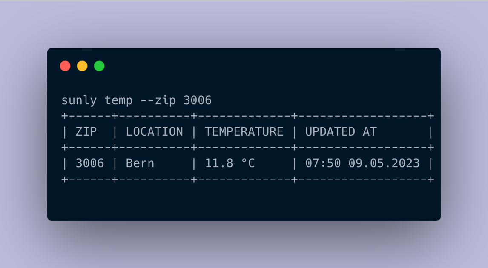

# Sunly - Weather CLI App

Sunly is a command-line interface (CLI) application written in Golang that provides weather information using Meteo Swiss as the source of data.



## Usage

Currently supported commands.

## Current temperature

To get the current temperature in a specific location, run the following command:
```bash
sunly temp --zip <zip>
```

## Backing APIs

- [Meteo Swiss](https://www.meteoschweiz.admin.ch/wetter/messsysteme/datenmanagement/datenintegration.html)
- [Swiss Post](https://swisspost.opendatasoft.com/explore/dataset/plz_verzeichnis_v2/information/)
